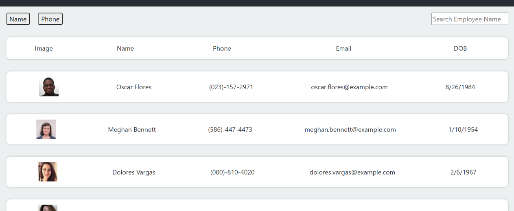
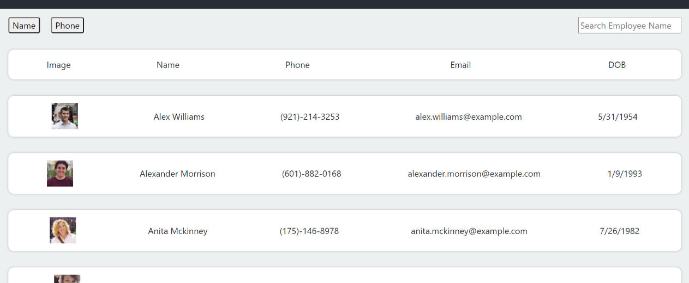
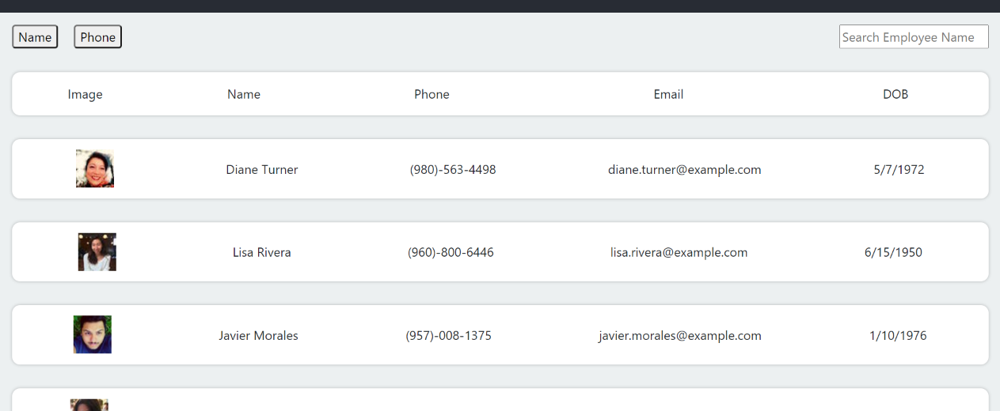
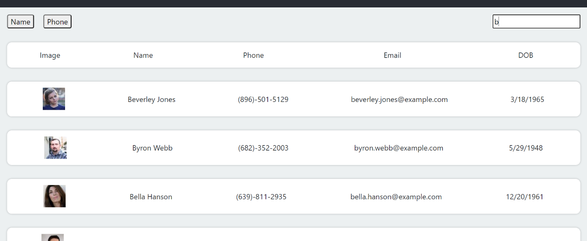

# Employee-Directory

## Descriptions
A React app that allows its users to view all employees in a directory and search by typing in a name or sort employees by Name or Phone.

## Repository
[Application Repository URL](https://github.com/cmcunningham27/Employee-Directory_React)

## Link to Deployed App
[Employee Directory App](https://cmcunningham27.github.io/Employee-Directory_React)

## Table of Contents
- [Project's-aim](#project's-aim)
- [Usage](#usage)
- [Technologies](#technologies)
- [License](#license)
- [Complications](#complications)
- [Features](#features)
- [Questions](#questions)

## Project's aim
1.

## Usage
1. 

## Technologies
* 

## License
This project is licensed under the MIT license.

## Complications
* 

## Features
In the future I would like to have links attached to each employee's name that would connect the user to that employees page that would include more in-depth information about themselves. A department column would be a great addition. However, that was not part of the information that was in the Random User API.

## Questions
[GitHub Profile](https://github.com/cmcunningham27)

[E-mail](mailto:sttepstutoring@yahoo.com)

E-mailing me is the best option
